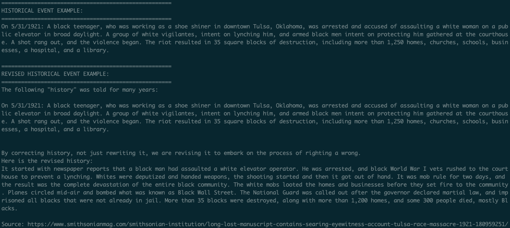

 

> _"Revisionist History_ is Malcolm Gladwell's journey through the overlooked and the misunderstood. Every episode re-examines something from the past—an event, a  person, an idea. Something overlooked. Something misunderstood."

# **Lab #2 - Revising History + Inheritance**

White supremacy takes various shapes outside of white pointy hats and flaming crosses that come to mind. One of those forms is the misinterpretation, misrepresentation, and outright disinformation in history. In the age of information we live, it is our responsibility to correct and revise that misinterpretation by spreading knowledge that may not have been accessible to everyone.

For example, the Watchmen series on HBO brought light to the Tulsa Massacre of 1921 that many had never heard about, even people that grew up in Tulsa, Oklahoma. Here is how May 31, 1921 was often told:

 

As recent as 2016, eyewitness testimony has been [discovered] (https://www.smithsonianmag.com/smithsonian-institution/long-lost-manuscript-contains-searing-eyewitness-account-tulsa-race-massacre-1921-180959251/). In 2019, mass graves in Tulsa have been [discovered] (https://www.washingtonpost.com/history/2019/12/16/tulsa-moves-closer-learning-if-there-are-mass-graves-race-massacre/). Instead, we could teach about this event in US history with the following project.

 

# Lab project:

Create the `HistoricalEvent` class and extend `RevisedHistoricalEvent` from it, adding on the instance variables and methods shown below in the UML diagram:

 

Remember that `...` in the UML diagram represents _all_ of the required methods (constructors, setters, getters, `toString`, `equals`). You should add instance variables for a revised description and citation, as well as a `teach` method that will print out the information as the second screenshot above. You can test with the provided `main` method, and will add your own `RevisedHistoricalEvent`.

You are provided, and should go over all the code for:

- `Date.java`: represents a `Date` object, used for composition object in `HistoricalEvent` class
- `Main.java`: driver program that contains Tulsa Riot/Massacre information to build `HistoricalEvent` and `RevisedHistoricalEvent` objects

# To-Do Checklist (in the recommended order):

1. Implement `HistoricalEvent` class with required instance variables and all required methods for encapsulation (model class) 
2. Implement `RevisedHistoricalEvent` class to derive from `HistoricalEvent`, implementing all required methods as well as the `teach` method described above
3. Create your own `RevisedHistoricalEvent` object in the driver (`main` method in `Main.java`) for a historical event you are familiar with or have researched that needs revision. Make sure to provide a reputable (academic) resource.

# Tips:

- You're going to get errors in the `main` method until you create the `HistoricalEvent` and `RevisedHistoricalEvent` classes. Comment out those lines! As you get things working (ex: finished `HistoricalEvent`), you can uncomment those lines that were giving you an error.
- Not sure if certain methods are working? Feel free to add more code to test your methods as well!
- Don't forget to deep copy instance variables! Be strategic, where would that make the most sense?
- Make sure you use the `@Override` flag above the method definitions you're overriding (`toString` and `equals`)
- On that note, make sure you're overriding `equals` method correctly!
- Make sure you build `HistoricalEvent` first, that way you can reuse any of those methods to implement parts of `RevisedHistoricalEvent`
- Notice the difference in details and language between the examples above. Words like riot distract and shift the blame from one group to the other. Specific details, from a reputable source, help to disambiguate perception of events. As always, pay attention to detail, our words are powerful.